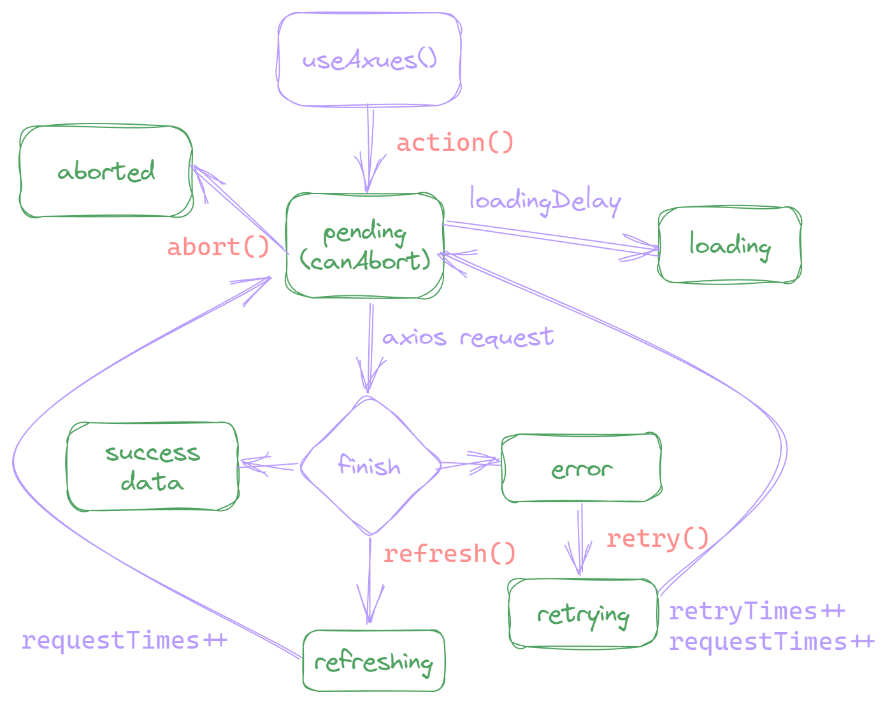

# 请求状态及方法

一次完整的请求过程，会经过请求中、请求成功、失败等状态。我们在写实际应用时，几乎每个页面都会涉及 HTTP 请求，如果每次使用请求都自己去定义这些状态，是一件非常繁琐的事情，所以我们需要 [组合式函数](https://cn.vuejs.org/guide/reusability/composables.html)。

Vue 的官方文档给了我们一个将请求状态封装成组合式函数的 [示例](https://cn.vuejs.org/guide/reusability/composables.html#async-state-example)，实际上，Axues 不过也就是将这个官方示例扩展得满足更多的使用场景而已。

## 总览

为了方便你更好的理解 Axues 的状态及方法，我们画了一个图：绿色为状态，红色为方法，每个操作背后都对应一个状态的变更。



可以看到，Axues 的状态非常多，这是 Axues 最大的特性之一：更细粒度的状态管理。这能让你做出体验更好的用户界面，也是我们标榜为生产力的原因。

举个简单的例子：当请求发生错误，用户点重试时，错误状态应该保留，这样我们可以在页面中 **同时** 显示错误信息和 loading 动画。而不是一点重试，整个屏幕就只展示一个 loading 动画，这是非常偷懒的做法。有关多状态共存，请参考：[写一个完整的列表页]()

## 触发请求（action）

Axues 使用 `action` 方法来作为请求的触发器，你只需在你想开始请求的时机来调用 `action` 方法，即可立即发起请求。

```vue
<script setup>
import { useAxues } from 'axues'
const { action } = useAxues('/api/foo')
</script>
<template>
  <button @click="action">开始请求</button>
</template>
```

如果你想声明完成后立即发起请求，那么只需给一个 immediate 配置项即可。

```javascript
import { useAxues } from 'axues'
const { data } = useAxues('/api/foo', { immediate: true })
```

> immediate 的默认值是 `false`，如果你多数请求都需要立即发起，每次都配置 immediate 是非常繁琐的，那么你可以考虑 [重写默认值](./rewrite-default-values)

有时我们可能想调用 `action` 时传不同的参数，从而发起不同的请求，比如说不同的调用传不同的参数（更多详情请参考 [请求配置扩展]()）。

```javascript
import { useAxues } from 'axues'
const { action } = useAxues('/api/foo', {
  params: actionPayload => ({ id: actionPayload })
})
action(1)
action(2)
```

::: tip 为什么命名为 `action` 而不是 `execute` 或其他？
每次从请求开始到渲染完成的过程，就像是一场戏，浏览器是剧场，JS 代码是剧本，HTML 是演员，css 是道具和装扮，只要导演发出 action 指令，演员们就会根据剧本完成演绎，那谁是那个导演呢？当然是我们的用户啦。
:::

## 请求中（pending & loading）

请求发起到请求完成，中间的状态就是请求中状态，Axues 有两个请求中状态：`pending` 和 `loading`，默认都为 `false`。当发起请求时，`pending` 会立即变为 `true`，而 `loading` 会延迟 300ms（默认，[可配置](./request-configuration#loadingdelay)）后变为 `true`，当请求完成后，又会重置为 `false`。

```javascript
import { useAxues } from 'axues'

const { loading, pending, action } = useAxues('/api/foo')
console.log(pending.value, loading.value) // false, false

action()
console.log(pending.value, loading.value) // true, false

// 假设请求超过300ms
setTimeout(() => {
  console.log(pending.value, loading.value) // true, true
}, 300)
```

::: tip 为什么要用两个状态来标识请求中？
我们一般都会将请求状态绑定到 loading 动画组件，但当请求足够快时，有可能会造成 loading 动画“闪一下”就消失，所以我们一般需要延迟执行 loading 动画，让用户更少的感知到加载的过程。而除了绑定 loading 动画，我们有可能还需要绑定其他东西，比如说用户点击后立即禁用按钮等，所以我们还要 pending 这个立即变化的状态。
:::

## 取消请求（canAbort & abort & aborted）

当请求非常慢时，用户可能没耐心等待，或是有时候用户误操作想反悔，那么给用户提供一个取消请求的操作是非常必要的。

在 Axues 中，仅当 pending 为 true，且浏览器支持 [`AbortController`](https://caniuse.com/?search=AbortController) 时，才能取消请求，你可以通过 `canAbort` 来判断当前是否可取消。调用 `abort` 方法来执行取消操作，当取消成功后，会将 `aborted` 的状态变更为 `true`。

```vue
<script setup>
import { useAxues } from 'axues'
const { pending, action, canAbort, abort, aborted } = useAxues('/api/foo')
</script>
<template>
  <div>
    <p v-if="pending">加载中...</p>
    <p v-if="aborted">请求已取消</p>
    <button @click="action">执行</button>
    <button @click="abort" v-if="canAbort">取消请求</button>
  </div>
</template>
```

请求和状态分开管理的场景，我们也可以为传入的请求方法提供取消操作，当然前提是请求方法支持 `AbortSignal`。

```javascript
import { useAxues, axues } from 'axues'

const fetchUsers = (actionPayload, signal) => fetch('/api/users', { signal })
const { loading, canAbort, action, abort } = useAxues(fetchUsers)

const fetchBooks = (actionPayload, signal) => axues.get('/api/books', { signal })
const { action: action2, abort: abort2 } = useAxues(fetchBooks)
```

## 请求成功（success）

Axues 使用 `success` 作为请求成功状态，初始化时为 `false`，当请求成功后变为 `true`。仅当重新调用 `action`，才会重置为 `false`（详情请参考 [写一个完整的列表页]()）

```vue
<script setup>
import { useAxues } from 'axues'
const { loading, success, data } = useAxues('/api/foo', { immediate: true })
</script>
<template>
  <div>
    <p v-if="loading">loading...</p>
    <div v-if="success">{{ data }}</div>
  </div>
</template>
```

## 响应数据（data）

我们请求是为了拿到数据，所以 `data` 才是最重要的状态，请求成功后，Axues 会给 `data` 默认赋值为 Axios 的 `response.data`，当然，你也可以在 [全局配置]() 中改变这个默认行为。

`data` 的初始值为 `null`，你可以通过配置项 `initialData` 改变初始值。

```vue
<script setup>
import { useAxues } from 'axues'
const { data, action } = useAxues({
  url: '/api/foo',
  initialData: { initVal: 1 }
})
console.log(data.value) // { initVal: 1 }
action().then(() => {
  // 假设请求返回结果是 { resValue: 2 }
  console.log(data.value) // { resValue: 2 }
})
</script>
<template>
  <div>{{ data }}</div>
</template>
```

除了全局配置、初始值设置，我们也可以在每个请求中自定义 data 的赋值。Axues 提供了一个可选的请求配置：`onData` 函数，当请求返回时，如果配置了 `onData`，会直接调用这个函数，你需要在 `onData` 中手动来给 data 赋值。这对于无限滚动的分页查询非常有用，详情请参考 [分页查询]()。

```javascript
import { useAxues } from 'axues'
const { data } = useAxues({
  url: '/api/foo',
  immediate: true,
  onData(data, newData) {
    // 按照你的需求给 data 赋值
    data.value = newData.data
  }
})
```

## 请求出错（error）

错误处理是编写用户界面最重要的一环，Axues 使用 `error` 来存储错误的状态，初始状态下，`error` 值为 `null`，仅当请求出错时，才会赋值为错误对象。

```javascript
import { useAxues } from 'axues'
const { error, action } = useAxues('/api/404')
console.log(error.value) // null

action().then(() => {
  console.log(error.value.instanceOf(Error)) // true
})
```

::: tip
你可以全局配置统一的错误处理策略，或者自定义错误对象，详情请参考 [全局响应 / 错误处理]()
:::

## 错误重试（retry & retrying & retryTimes）

当请求发生错误时，提供重试操作是用户体验的重要一环，Axues 提供了 `retry` 方法来作为重试的操作，当调用 `retry` 时，会将 `retrying` 的值设为 `true`，并且会累加 `retryTimes`。

```vue
<script setup>
import { useAxues } from 'axues'
const { pending, error, action, retryTimes, retry, retrying } = useAxues('/api/foo')
</script>
<template>
  <div>
    <button @click="action">开始请求</button>
    <div v-if="error">
      <p>请求出错: {{ error.message }}</p>
      <p>
        重试次数: {{ retryTimes }}
        <button @click="retry" v-if="!retrying">重试</button>
      </p>
    </div>
    <p v-if="pending">正在请求...</p>
    <p v-if="retrying">正在重试...</p>
  </div>
</template>
```

除了提供手动的 retry 方法，Axues 还支持配置错误自动重试，详情请参考 [错误重试]()。
::: warning
上面的例子已经提到，重试时，Axues 不会将 error 状态重置，且 retrying 和 pending 状态也会共存，详情请参考 [写一个完整的列表页]()。当然，如果你的请求很简单，你可以完全忽视 retrying 这个状态。
:::

## 刷新（refresh & refreshing）

和重试一样，Axues 提供了 `refresh` 方法和 `refreshing` 状态来管理刷新操作和状态。

```vue
<script setup>
import { useAxues } from 'axues'
const { loading, error, data, action, refresh, refreshing } = useAxues('/api/foo')
</script>
<template>
  <div>
    <p v-if="loading">正在加载...</p>
    <p v-if="refreshing">正在刷新...</p>
    <div v-if="data">{{ data }}</div>
    <p v-if="error">请求出错: {{ error.message }}</p>
    <button @click="action">开始请求</button>
    <button @click="refresh">刷新</button>
  </div>
</template>
```

你可能会想，重试和刷新是不是有点冲突？

一般情况下，我们只会在请求错误时提供重试，而刷新不同，请求成功的状态下，我们也可能需要刷新操作。从机制上来讲，重试是重新发起最后一次请求，而刷新是重新发起第一次请求。其实大部分简单的请求，你使用其中的一个就好，只有在做复杂的请求时，你才有可能同时使用它们。

::: tip
我们上面讲过，`action` 的支持传参的，当首次调用 `action` 发起请求后，Axues 会将请求的参数、状态缓存起来，后面不管再调用多少次 `action`，一旦调用刷新，则又会回到第一次请求的状态。对于重置到第一次请求的状态，你可能还心存疑惑。还是那句话，简单的请求中，你完全可以忽略 `refresh` 的存在，当你阅读到 [分页查询]() 章节，你就明白为什么这么做了。
:::

## 请求次数（requestTimes）

每次发起请求，都会累加请求次数，Axues 将 `requestTimes` 暴露出来，目的是为了你更好调试、观测当前请求的状态。

```javascript
import { useAxues } from 'axues'
const { requestTimes, action, refresh } = useAxues('/api/foo')
console.log(requestTimes.value) // 0

action().then(() => {
  console.log(requestTimes.value) // 1
})

action().then(() => {
  console.log(requestTimes.value) // 2
})

refresh().then(() => {
  console.log(requestTimes.value) // 1
})
```

上面的图也有标明：刷新会将 `requestTimes`（请求次数） 重置为 0，而重试则会累加。
