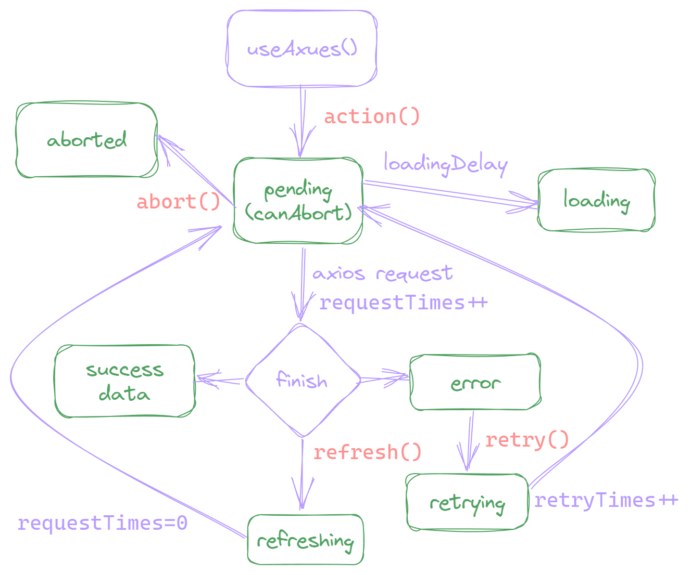

# 请求状态及方法

一次完整的请求过程，会经过请求中、请求成功、失败等状态。我们在写实际应用时，几乎每个页面都会涉及 HTTP 请求，如果每次使用请求都自己去定义这些状态，是一件非常繁琐的事情，所以我们需要 [组合式函数](https://cn.vuejs.org/guide/reusability/composables.html)。

Vue 的官方文档给了我们一个将请求状态封装成组合式函数的 [示例](https://cn.vuejs.org/guide/reusability/composables.html#async-state-example)，实际上，Axues 不过也就是将这个官方示例扩展得满足更多的使用场景而已。

## 总览

为了方便你更好的理解 Axues 的状态及方法，我们画了一个图：绿色为状态，红色为方法，每个操作背后都对应一个状态的变更。



可以看到，Axues 的状态非常多，这是 Axues 最大的特性之一：更细粒度的状态管理。这能让你做出体验更好的用户界面，也是我们标榜为生产力的原因。

举个简单的例子：当请求发生错误，用户点重试时，错误状态应该保留，这样我们可以在页面中 **同时** 显示错误信息和 loading 动画。而不是一点重试，整个屏幕就只展示一个 loading 动画，这是非常偷懒的做法。有关多状态共存，请参考：[写一个完整的列表页]()

## 触发请求（action）

Axues 使用 `action` 方法来作为请求的触发器，你只需在你想开始请求的时机来调用 `action` 方法，即可立即发起请求。

```vue
<script setup>
import { useAxues } from 'axues'
const { action } = useAxues('/api/foo')
</script>
<template>
  <button @click="action">开始请求</button>
</template>
```

如果你想声明完成后立即发起请求，那么只需给一个 immediate 配置项即可。

```javascript
import { useAxues } from 'axues'
const { data } = useAxues('/api/foo', { immediate: true })
```

> immediate 的默认值是 `false`，如果你多数请求都需要立即发起，每次都配置 immediate 是非常繁琐的，那么你可以考虑 [重写默认值](./rewrite-default-values)

有时我们可能想调用 `action` 时传不同的参数，从而发起不同的请求，比如说不同的调用传不同的参数（更多详情请参考 [请求配置扩展]()）。

```javascript
import { useAxues } from 'axues'
const { action } = useAxues('/api/foo', {
  params: actionPayload => ({ id: actionPayload })
})
action(1)
action(2)
```

::: tip 为什么命名为 `action` 而不是 `execute` 或其他？
每次从请求开始到渲染完成的过程，就像是一场戏，浏览器是剧场，JS 代码是剧本，HTML 是演员，css 是道具和装扮，只要导演发出 action 指令，演员们就会根据剧本完成演绎，那谁是那个导演呢？当然是我们的用户啦。
:::

## 请求中（pending & loading）

请求发起到请求完成，中间的状态就是请求中状态，Axues 有两个请求中状态：`pending` 和 `loading`，默认都为 `false`。当发起请求时，`pending` 会立即变为 `true`，而 `loading` 会延迟 200ms（默认，[可配置]()）后变为 `true`，当请求完成后，又会重置为 `false`。

```javascript
import { useAxues } from 'axues'

const { loading, pending, action } = useAxues('/api/foo')
console.log(pending, loading) // false, false

action()
console.log(pending, loading) // true, false

// 假设请求超过200ms
setTimeout(() => {
  console.log(pending, loading) // true, true
}, 200)
```

::: tip 为什么要用两个状态来标识请求中？
我们一般都会将请求状态绑定到 loading 动画组件，但当请求足够快时，有可能会造成 loading 动画“闪一下”就消失，所以我们一般需要延迟执行 loading 动画，让用户更少的感知到加载的过程。而除了绑定 loading 动画，我们有可能还需要绑定其他东西，比如说用户点击后立即禁用按钮等，所以我们还要 pending 这个立即变化的状态。
:::

## 取消请求（canAbort & abort & aborted）

当请求非常慢时，用户可能没耐心等待，或是有时候用户误操作想反悔，那么给用户提供一个取消请求的操作是非常必要的。

在 Axues 中，仅当 pending 为 true，且浏览器支持 [`AbortController`](https://caniuse.com/?search=AbortController) 时，才能取消请求，你可以通过 `canAbort` 来判断当前是否可取消。调用 `abort` 方法来执行取消操作，当取消成功后，会将 `aborted` 的状态变更为 `true`。

```vue
<script setup>
import { useAxues } from 'axues'
const { pending, action, canAbort, abort, aborted } = useAxues('/api/foo')
</script>
<template>
  <div>
    <p v-if="pending">加载中...</p>
    <p v-if="aborted">请求已取消</p>
    <button @click="action">执行</button>
    <button @click="abort" v-if="canAbort">取消请求</button>
  </div>
</template>
```

请求和状态分开管理的场景，我们也可以为传入的请求方法提供取消操作，当然前提是请求方法支持 `AbortSignal`。

```javascript
import { useAxues, axues } from 'axues'

const fetchUsers = (actionPayload, signal) => fetch('/api/users', { signal })
const { loading, canAbort, action, abort } = useAxues(fetchUsers)

const fetchBooks = (actionPayload, signal) => axues.get('/api/books', { signal })
const { action: action2, abort: abort2 } = useAxues(fetchBooks)
```

## 请求成功（success）

Axues 使用 `success` 作为请求成功状态，初始化时为 `false`，当请求成功后变为 `true`。仅当重新调用 `action`，才会重置为 `false`（详情请参考 [写一个完整的列表页]()）

```vue
<script setup>
import { useAxues } from 'axues'
const { loading, success, data } = useAxues('/api/foo', { immediate: true })
</script>
<template>
  <div>
    <p v-if="loading">loading...</p>
    <div v-if="success">{{ data }}</div>
  </div>
</template>
```

## 响应数据（data）

我们请求是为了拿到数据，所以 `data` 才是最重要的状态

## 请求出错（error）

## 错误重试（retry & retrying）

## 刷新（refresh & refreshing）

## 请求次数（requestTimes）
